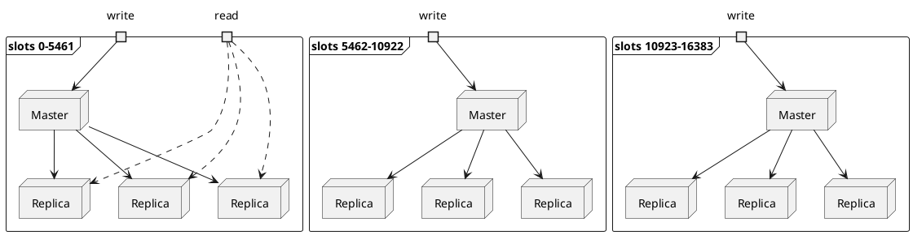
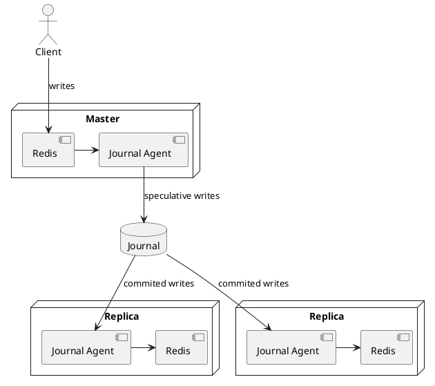
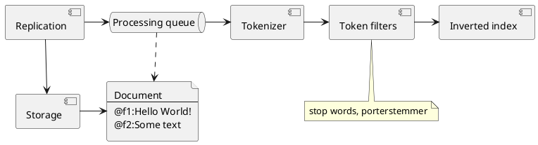
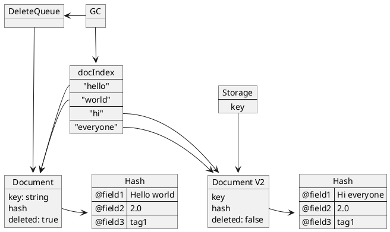

# Реализация модуля полнотекстового поиска для СУБД Redis

Содержание - поправить

1. Введение
2. Описание предметной области
   1. Требования к модулю
      1. Функциональные требования
      2. Нефункциональные требования
3. Проектирование
   1. Системная архитектура
   2. Программная архитектура
      1. Хранилище документов
      2. Репликация данных с ведущего узла
      3. Построение инвертированного индекса
      4. Индексирование существующих документов
      5. Выполнение запроса
      6. Ранжирование результатов
      7. Парсинг запросов
      8. TCP-сервер с использованием протокола RESP
4. Реализация
   1. Стек технологий
   2. Разработка
5. Тестирование


## Введение

**TODO: написать нормальное введение с четкой целью работы**

## Описание предметной области

Amazon Web Services - это самая распространенная в мире облачная платформа, 
предлагающая большое количество сервисов, упрощающие клиентам создание информационных систем.
Двумя продуктами, которые будут рассмотрены далее, являются Amazon ElastiCache для Redis и Amazon MemoryDB для Redis.

Amazon ElastiCache для Redis - это сервис, предоставляющий полностью управляемую СУБД Redis.
Redis является быстрой нереляционной системой хранения данных в формате "ключ-значение" и используется в основном для кэширования часто используемых данных.
Redis является редизентной СУБД, т.е. хранит данные в памяти, благодаря чему обеспечивается очень большая скорость операций как чтения, так и записи - в среднем менее миллисекунды.

Redis поддерживает репликацию данных между единственным лидером, который принимает операции записи, 
и несколькими репликами - вторичными узлами. Реплики принимают только запросы на чтение, что позволяет обрабатывать больше таких операций.
Также, репликация повышает надежность СУБД, т.к. при внезапной остановке или временной недоступности лидера один из вторичных узлов
берет на себя его роль, благодаря этому СУБД доступна на запись. 
При этом Redis не предоставляет гарантий сохранности данных, т.к. это потребовало бы значительного снижения производительности.
Репликация происходит асинхронно, т.е. операция чтения с реплики может не содержать данных, 
которые были записаны на лидер, но еще не были реплицированы.

Благодаря простой структуре хранения данных "ключ-значение", Redis поддерживает кластеризацию, разделяя данные на несколько шардов. 
Данные разделяются на 16384 хэш-слота, каждому шарду присваивается набор хэш-слотов. 
Для того, чтобы определить к какому хэш-слоту, а следовательно, и к какому шарду относятся данные, необходимо вычислить значение хэш-функции ключа и найти остаток от деления на количество шардов в кластере.

Архитектура кластера СУБД Redis представлена на следующей диаграмме:



Amazon ElastiCache полностью управляет СУБД, обеспечивая мониторинг состояния узлов, 
автоматическое восстановление проблемных узлов, горизонтальное масштабирование с помощью увеличения количества шардов в кластере, 
вертикальное масштабирование с помощью изменения типа виртуальных машин, на которых работают узлы СУБД, 
а также автоматизированное обновление ОС и самой СУБД.

Amazon MemoryDB - это совместимая с Redis СУБД, модифицированная для того, 
чтобы обеспечить надежную персистентность хранения данных с помощью использования распределенного лога транзакций, 
при этом сохраняя преимущества скорости СУБД Redis - чтение менее, чем за 1 мс, и запись менее, чем за 10 мс. 
Гарантия персистентности позволяет использовать MemoryDB как основную СУБД, а не только как систему кэширования данных.

MemoryDB, как и Redis, поддерживает шардирование кластера.

Персистентность обеспечивается с помощью того, что команды записи не реплицируются напрямую на реплики, а сначала записываются в распределенный лог транзакций (называемый Journal - журналом), использующий алгоритм распределенного консенсуса для обеспечения гарантии консистентности. До того момента, как транзакция записана в лог, новые данные недоступны для чтения.



Redis позволяет сохранять в качестве значений не только строки и числа, 
а также такие структуры данных, как списки, т.н. хэши - объекты, представляющие из себя хэш-таблицы, JSON-документы, и т.д.

### Требования к модулю полнотекстового поиска

Несмотря на то, что основное предназначение систем типа "ключ-значение" - быстро находить значение по заданному ключу,
у пользователей в некоторых случаях появляется потребность обеспечить поиск по сохраненным значениям. 
В частности, достаточно часто появляется необходимость искать объекты по значению поля хэша или JSON-документа.
Одним из самых востребованных является полнотекстовый поиск, необходимый для того, 
чтобы клиенты могли очень быстро предоставлять своим пользователям результаты их поисковых запросов.
Возможность поиска становится еще более необходимой для Amazon MemoryDB, 
который используется многими клиентами как основное хранилище данных.

Данный функционал реализован в модуле RediSearch. 
Он обеспечивает построение индексов и полнотекстового поиска с поддержкой логичских операторов над подзапросами, запросов на основе префикса слова, а также некоторых других возможностей.

Несмотря на широкие возможности данного модуля, 
Amazon Web Services не может использовать его для своих продуктов Amazon ElastiCache и Amazon MemoryDB,
т.к. он использует лицензию Redis Source Available License 2.0, 
которая запрещает предоставление этого модуля пользователям с бизнес-моделью "ПО как сервис", 
т.е. той моделью, по которой работает AWS.

В связи с этим появилась необходимость создать модуль полнотекстового поиска, 
реализующий основные возможности RediSearch. 

### Функциональные требования

Для первой версии было принято решение реализовать только основные возможности RediSearch: 
1. Поиск документов, содержащих определенные термины, с поддержкой разных форм слова
2. Поддержка логических операторов между подзапросами
   - объединение данных подзапросов (логический оператор OR) - вернуть все документы, удовлетворяющие одному из подзапросов
   - пересечение данных подзапросов (логический оператор AND) - вернуть все документы, удовлетворяющие всем подзапросам
3. Запрос по значению конкретного поля документа
4. Ранжирование результатов
5. Ограничение максимального количества подходящих результатов

### Нефункциональные требования

Поскольку клиенты выбирают ElastiCache и MemoryDB за низкую задержку ответов и обеспечение выполнения большого количества транзакций в секунду, это требуется и для модуля полнотекстового поиска.
Время отклика для данной системы является важнее, чем точность и полнота результата.

Также, модуль должен обеспечивать не только большую скорость операций поиска, но и достаточную скорость операций записи, чтобы справляться с большим объемом поступающих от клиента данных.

Модуль должен поддерживать как горизонтальное, так и вертикальное масштабирование, т.е. обеспечивать эффективную работу как в условиях 1 ядра процессора и небольшого объема оперативной памяти, так и в условиях большого количества ядер и большого объема оперативной памяти (до 96 ядер и 600 Гб оперативной памяти).

**TODO: написать нормальные численные метрики**

## Проектирование

### Системная архитектура

При проектировании данного модуля возникло два варианта: реализовать модуль для каждого из узлов БД, или реализовать его как отдельно работающий узел кластера. 

Реализация модуля на уровне каждого узла кластера имеет следующие преимущества:
1. Простое распределение нагрузки между узлами, т.к. каждый из узлов может обрабатывать запросы поиска
2. Кластер остается гомогенным, т.е. нет необходимости разделять узлы, которые могут обрабатывать запросы на чтение по ключу и узлы, обрабатывающие запросы полнотекстового поиска

При этом такой тип реализации имеет следующие недостатки:
1. Возрастает нагрузка на каждый узел СУБД, 
  т.к. при сохранении нового объекта требуется произвести обновление индексов, следовательно, узел может обрабатывать меньшую пиковую нагрузку.
2. Обновление происходит не только на ведущем узле, но и на всех репликах, что может повлечь за собой увеличение 
  отставание узлов по репликации данных, 
  что, в свою очередь, может повлечь за собой потерю данных при внезапной остановке ведущего узла
  в случае ElastiCache (не имеющего распределенного лога транзакций), 
  либо более долгое переключение на другой узел в случае MemoryDB (т.к. большее количество данных будет необходимо восстановить из распределенного лога перед тем, как узел сможет претендовать на роль ведущего)
3. Полнотекстовый индекс может занимать достаточно большое количество памяти, 
  что уменьшает максимально возможный объем хранимых данных. 
  Это может оказаться большой проблемой для клиентов, использующих узлы с 0.5 и 1.3 Гб оперативной памяти.
  Это также увеличивает шансы клиента использовать оперативную память узла более, чем на 50%, 
  что не позволяет работать самому эффективному способу создания резервной копии СУБД - созданию копии (fork) процесса с последующей записью резервной копии на диск.
  Использование более медленного способа резервного копирования может полвечь за собой потерю клиентом части данных.

Реализация модуля поиска как отдельного узла также имеет свои преимущества:
1. Нагрузка на выполнение поисковых запросов может масштабироваться независимо, 
  т.е. при необходимоси можно увеличивать максимальное количество запросов полнотекстового поиска с помощью увеличения количества соответствующих индексных узлов
2. Индексные узлы могут быть созданы по требованию, т.е. не требуют модификаций существующих узлов кластера
3. Такая реализация не будет ограничена однопоточным ядром выполнения Redis, 
  что может значительно положительно повлиять на производительность модуля. 
  Однопоточная архитектура Redis весьма эффективна для быстро выполняющихся команд чтения по ключу,
  но может быть неэффективна для более долгих команд поиска.
4. Индексные узлы не ограничены API СУБД Redis для встраиваемых модулей и могут использовать свои оптимизации хранения, создания резервный копий и выполнения зарпосов.

Из недостатков можно отметить:
1. Гетерогенность кластера, что ведет к усложнению управления им, 
  но этот недостаток нивелируется тем, что ElastiCache и MemoryDB является полностью управляемыми кластерами,
  т.е. усложнение управления кластером скрыто от клиента
2. Отсутствие возможности у других узлов обработать запрос - что может быть решено либо проксированием запроса на индексный узел, либо созданием выделенного узла, проксирующего запросы на нужный узел, что уже реализовано в AWS.
3. Большее отставание данных в сравнении с обычными репликами, что является допустимым, но нежелательным.

Для данного проекта было принято решение реализовывать полнотекстовый поиск с помощью отдельных узлов 
с возможностью в будущем интегрировать его в сами узлы СУБД.

```plantuml
node "Proxy node" {
    component Proxy as p
}

node Master {
    component Redis as mredis {
      artifact "FTSearch module" as ftsmm
    }
}

node Replica as r1 {
    component Redis as r1redis {
      artifact "FTSearch module" as ftsmr1
    }
}

node Replica as r2 {
    component Redis as r2redis {
      artifact "FTSearch module" as ftsmr2
    }
}

node FTSReplica1 {
    component FTSIndex as ftsi1
}
note left: Full text search\n index

node FTSReplica2 {
    component FTSIndex as ftsi2
}

mredis --> r1redis: replication
mredis --> r2redis
mredis --> ftsi1

p --> mredis: write
p ---> r1redis: read
p ----> ftsi1: search
p ----> ftsi2: search
```
*Архитектура шарда СУБД*

При этом команды создания индекса обрабатываются отдельным модулем, встраиваемым в саму СУБД Redis
в формате статической библиотеки, благодаря чему информация о созданных индексах 
(параметры индекса, но не сам индекс) реплицируется
на все остальные узлы и может быть получена узлом полнотекстового поиска в том же формате,
что и репликация остальных данных, что увеличивает надежность. Также, такая архитектура
позволяет легко реализовать горизонтальное масштабирование запросов поиска по полнотекстовому индексу
с помощью добавления в кластер новых индексирующих узлов, при этом каждый узел независимо от других
получит информацию о созданных индексах от ведущего узла.

### Программная архитектура

Были выиделены следующие основные компоненты модуля:
1. Компонент хранилища данных, по сути являющийся хэш-таблицей, в которой ключу сопоставляется конкретный документ
2. Компонент репликации данных с ведущего узла
3. Компонент индексации документов и хранения инвертированного индекса
4. Компонент лениво вычисляемых итераторов по данных индекса, обеспечивающих выполнение запросов поиска с использованием различных итераторов
5. Компонент парсинга поисковых запросов
6. Серверный компонент, обрабатывающий пользовательские запросы в формате передачи данных RESP, используемом в СУБД Redis.

```plantuml
class Server

class "RESP Parser" as rp

class "Query parser" as qp

class "Search Engine" as se

class "Index" as i

class "Storage" as s

class "Document" as d

interface "TermIterator" as iter

class "Replication" as repl

Server *-- rp
Server *-- qp
Server *-- se
se o-- i
i -- iter
iter ..> s
s o-- d
repl --> s
```

#### Хранилище документов

Основные функции, которые должно выполнять хранилище документов - это чтение по ключу, 
сохранение нового документа, удаление документа и переименование ключа. 
Функция обновления документа может быть реализована через удаление существующей версии и 
сохранение обновленной версии как нового документа. 
Такой подход связан с особенностями инвертированного индекса, которые будут рассмотрены далее.

Для реагирования других компонентов на операции обновления данных (сохранение и удаление) 
хранилище должно также использовать callback-функции, вызываемые после выполнения тех или иных операций.
Для данного модуля требуется реагирование на операцию сохранения для того, 
чтобы проиндексировать новый документ, а также на операцию удаления, для того, чтобы удалить данные из индекса.

Также, поскольку новые индексы могут быть созданы после того, как часть документов была сохранена,
хранилище должно предоставлять способ пройти по всем сохраненным парам ключ-документ, 
удовлетворяющим определенному префиксу ключа, для их индексации.

В качестве структуры данных для хранилища документов наилучшим образом подходит хэш-таблица,
в которой ключу сопоставляется сам документ. Необходимо также учесть, что доступ к хранилищу
может производиться из нескольких потоков в процессе обработки пользовательских запросов поиска,
что требует синхронизовать доступ к хэш-таблице, 
для чего наиболее подходящим примитивом синхронизации является RW-lock - блокировка чтения-записи,
позволяющая одновременный доступ на чтение нескольким конкурентным задачам, при этом допуская лишь
эксклюзивный доступ только одной задачи изменения данных. Одним из следствий данной архитектуры
является отсутствие преимуществ применения конкурентной репликации данных, 
но обеспечение конкурентного выполнения нескольких запросов полнотекстового поиска.

#### Репликация данных с ведущего узла

В СУБД Redis используется два подхода к сохранению данных на диск: 
сохранение снимков БД в формате RDB и запись самих команд обновления данных в формате AOF - append only file,
т.е. файла, данные в который только добавляются в конец, но не обновляются.
RDB снимок требует меньше дискового пространства, 
т.к. использует бинарный формат и хранит только актуальные данные,
но для эффективного создания такого снимка Redis создает fork (копию) процесса ОС, 
который затем записывает данные из оперативной памяти на диск в этом формате.
Для этого требуется, чтобы как минимум равный текущему размеру БД объем оперативной памяти был свободен,
т.к. все данные хранятся в ней и создается полная копия процесса.

Репликация в СУБД Redis реализована с помощью комбинации этих подходов.
Когда новая реплика устанавливает TCP-подключение к ведущему узлу, она запрашивает сохраненные данные,
которые поступают в формате RDB. В актуальных версиях Redis может отправлять снимок, 
напрямую копируя из оперативной памяти в буфер TCP-подключения, без промежуточного создания снимка на диске.
Все последующие данные реплика получает в формате AOF, т.е. по сути в таком же формате, 
в котором пользователь выполняет команды обновления.

Для отслеживания состояния репликации каждый узел отслеживает количество байт, обработанный 
на текущий момент. Это число называется offset - смещение. Изначально оно является равным
полученному размеру бинарных данных в формате RDB, затем увеличивается каждый раз при получении
команды в формате AOF на ее длину байт. Реплика периодически сообщает текущее значение смещения
на ведущий узел, благодаря чему он может отслеживать состояние каждой из реплик.

В случае отсутствия пользовательских команд реплика получает от ведущего узла команду `ping` в том же AOF формате раз в несколько секунд,
благодаря чему может быть осуществлена проверка того, что ведущий узел продолжает репликацию в нормальном режиме.
Реплика, в свою очередь, должна раз в секунду отправлять по тому же TCP-подключению команду `replconf ack <offset>`, где offset - текущее обработанное смещение.
В случае отсутствия такого ответа от реплики в течение 60 секунд ведущий узел разрывает соединение с ней.

Созданный модуль должен работать с обоими форматами для того, 
чтобы выступать в роли реплики для ведущего узла и не требовать модификаций логики репликации в самой СУБД.
Также, модуль должен правильно работать с командами репликации между ведущим узлом и репликой (отправляя `replconf ack`).

Также, был принят во внимание тот факт, что информация о текущем обработанном смещении реплики 
используется для того, чтобы производить смену ролей (failover) по команде пользователя.
Ведущий узел выбирает для нового лидера ту реплику, смещение которой равно его собственному смещению,
что означает, что реплика полностью синхронизирована и содержит все данные, которые содержит ведущий узел.
Т.к. архитектура модуля не предполагает использование его в качестве ведущего узла,
было принято решение всегда подтверждать смещение на 1 меньше, чем актуальное смещение ведущего узла.

Для унификации обработки двух различных видов репликации было принято решение преобразовывать как
данные из формата RDB, так и команды в формате AOF в объекты классов, реализующих интерфейс Command.
При этом каждый такой класс представляет собой информацию о соответствующей ему конкретной пользовательской
командой, которая может быть получена в текстовом формате с помощью AOF репликации.

```plantuml
interface exec.Command {
  Name()
  exec(storage.Storage, search.Engine)
}

class exec.SetCmd {
  Key: string
}

class exec.DelCmd {
  Key: string
}

class exec.HSetCmd {
  Key: string
  Args: HSetArg[]
}

class exec.HDelCmd {
  Key: string
  Fields: string[]
}

class exec.FtCreateCmd {
  Name: string
	Prefixes: string[]
	Fields: string[]
}

class storage.Storage
class search.Engine

exec.Command <|-- exec.SetCmd
exec.Command <|-- exec.DelCmd
exec.Command <|-- exec.HSetCmd
exec.Command <|-- exec.HDelCmd
exec.Command <|-- exec.FtCreateCmd

exec.SetCmd -- storage.Storage
exec.DelCmd -- storage.Storage
exec.HSetCmd -- storage.Storage
exec.HDelCmd -- storage.Storage
exec.FtCreateCmd -- search.Engine
```

*Диаграмма классов команд*

#### Построение инвертированного индекса

Для того, чтобы обрабатывать запросы полнотекстового поиска, необходимо построить инвертированный индекс,
т.е. структуру данных, в котоорой каждому термину, который встретился в документах, сопоставляются все документы, в которых он встретился. Для того, чтобы учитывать взаимное расположение терминов относительно друг друга, индекс также должен включать информацию о позиции термина в документе.

Для того, чтобы индекс позволял осуществлять поиск по различным формам термина, необходимо:
1. токенизировать документ, т.е. разделить на отдельные слова;
2. удалить стоп-слова;
3. запомнить позицию каждого токена, т.е. поле документа, в котором он находится, и его порядковый номер;
4. произвести стемминг или лемматизацию для нахождения основы слова и дальнейшего поиска по ней.



Для данной реализации было принято решение применить стемминг, т.к. он хоть и дает менее точные результаты,
чем лемматизация, но при этом является сильно более производительным, 
что является критически важным для используемой СУБД.

В качестве стандартной реализации был применен алгоритм Стеммер Портера, показывающий хорошие результаты для английского языка, 
при этом в будущем система должна позволять клиенту определять используемый алгоритм для поддержки других языков.

Поскольку удаление из индекса не может быть выполнено моментально,
был применен подход "сборщика мусора", при котором
документ лишь помечается удаленным и впоследствии фильтруется при чтении данных из индекса, 
после чего добавляется в очередь для удаления, что позволяет обработать большую нагрузку,
откладывая обновление индекса.

Обновление документа также может быть осуществлено через удаление предыдущей версии и сохранение новой.



Оптимальной структурой данных для хранения информации о документах, содержащих конкретный токен,
было выбрано префиксное дерево, т.к. оно позволяет легко в будущем реализовать поиск по префиксу,
доступный в модуле RediSearch, при этом асимптотика поиска по ключу для него O(k), где k - длина ключа.

Для построения инвертированного индекса каждому найденному токену сопоставляется список документов,
в которых он содержится, вместе с информацией о том, в каких полях этого документа он был найден.
Для каждого документа также содержится список вхождений в конкретном поле.

```plantuml
class FTSIndex {
  Fields: string[]
  trie: Trie<string, DocTermOccurrence>
}

FTSIndex o-- DocTermOccurrence

class DocTermOccurrence {
  Doc: *Document
  Fields: BitSet
  Occurrences: FieldTermOccurrence[]
}

DocTermOccurrence o-- FieldTermOccurrence

class FieldTermOccurrence {
  FieldIdx: int
  Offset : int
	Len: int
	Pos: int
}
```

*Архитектура хранения информации о вхождениях токенов в документе*

```plantuml
map document {
  title => Hello World!
  description => Hello, such beautiful place as Earth
}

object "DocTermOccurrence: Hello" as helloOcc {
  Doc
  Fields: [title, description]
  Occurrences
}

object "FieldTermOccurrence: Hello in title" as helloTitleOcc {
  fieldIdx: 0
  Offset: 0
  Len: 5
  Pos: 0
}

object "FieldTermOcurrence: Hello in description" as helloDescriptionOcc {
  fieldIdx: 1
  Offset: 0
  Len: 5
  Pos: 0
}

helloOcc::Occurrences --> helloTitleOcc
helloOcc::Occurrences --> helloDescriptionOcc
helloOcc::Doc ...> document

object "DocTermOccurrence: World" as worldOcc {
  Fields: [title]
  Occurrences
}

object "FieldTermOccurrence: World in title" as worldTitleOcc {
  fieldIdx: 0
  Offset: 0
  Len: 5
  Pos: 0
}

worldOcc::Occurrences --> worldTitleOcc
worldOcc::Doc ...> document

map trie {
  hello *--> helloOcc
  world *--> worldOcc
  ... => 
}
```

*Пример хранения информации о вхождениях токенов в документе*

#### Индексирование существующих документов

Индекс может быть создан уже после того, как документы будут сохранены в базе данных,
что требует поддержки их индексирования. В различных СУБД эта задача решается двумя способами:
индексирование документов в момент создания индекса (синхронно) и индексирование документов после его создания (асинхронно). 
В первом случае пользователь может пользоваться индексом сразу после его создания, 
т.к. он уже будет содержать всю необходимую информацию, в отличие от второго случая,
когда некоторое время после создания индекс будет лишь обрабатывать уже существующие данные.
При этом у первого случая есть критический недостаток, из-за которого было принято решение использовать
асинхронную реализацию - для него требуется блокирование клиентского подключения до момента завершения
индексирования, что может занять от нескольких секунд до нескольких часов, из-за чего возрастает риск
потери соединения, после чего либо требуется продолжать индексирование (т.е. переходить в асинхронный режим),
либо отменять создание индекса (т.е. вычислительные ресурсы были потрачены впустую).

Для асинхронного режима создания индекса требуется также отслеживать документы, 
добавленные после создания индекса, но до завершения индексирования существующих документов.
Для этого индекс может содержать очередь документов, которая будет использоваться как временное хранилище документов, требующих обработки. После того, как обработка документов, добавленных до создания индекса, будет закончена, индекс должен обработать все документы, находящиеся в очереди, а затем перейти в нормальный режим работы.

#### Выполнение запроса

Выполнение запроса состоит из применения нескольких операций над данными, сохраненными в инвертированном индексе:
- чтение всех документов, содержащих конкретный термин
- объединение результатов - например, запрос hello | world должен вернуть все документы, содержащие либо термин *hello*, либо термин *world*
- пересечение результатов - например, запрос hello world должен вернуть все документы, содержащие термины *hello* и *world*, при этом отдавая преимущество тем документам, где эти термины находятся ближе друг к другу
- фильтрация результатов по конкретному полю - клиент может указать, что поиск должен выполняться по содержимому конкретного поля документа, например, запрос @title:(hello world) должен вернуть документы, содержащие термины *hello* и *world* в поле документа *title*
- поиск терминов, идущих строго друг за другом - например, запрос hello NEAR world должен вернуть все документы, содержащие термины hello world без любых терминов между ними
- фильтрация определенного количества подходящих результатов - т.к. запросу может удовлетворять большое количество документов, у клиента должна быть возможность указать максимальное количество документов, которые он хочет получить.

Для реализации этих требований было принято решение использовать лениво вычисляемые итераторы.

```plantuml
interface "TermIterator" as iter {
  Next()
}

class "ReadIterator" as ri
class "UnionIterator" as ui
class "IntersectIterator" as ii
class "FieldIterator" as fi
class "NearIterator" as ni
class "TopNIterator" as ti

iter <|-- ri
iter <|-- ui
iter <|-- ii
iter <|-- fi
iter <|-- ni
iter <|-- ti
```

*Архитектура итераторов*

Пользовательский запрос должен быть превращен в комбинацию этих итераторов, данные из корневого итератора должны быть отправлены клиенту.
Итераторы в листьях этого дерева читают данные из инвертированного индекса, промежуточные итераторы комбинируют полученные данные и производят дополнительную фильтрацию.

```plantuml
object "ReadIterator" as hello {
  hello
}

object "ReadIterator" as world {
  world
}

object "ReadIterator" as sunshine {
  sunshine
}

object "UnionIterator" as union

object "IntersectIterator" as intersect

object "TopNIterator" as topn {
  10
}

union --> world
union --> sunshine
intersect --> union
intersect --> hello
topn --> intersect
```

*Пример итераторов для выполнения запроса `hello (world | sunshine) LIMIT 0 10`*

#### Ранжирование результатов

Важной задачей полнотекстового поиска является не только поиск документов,
содержащих определенные термины, но также и ранжирование результатов.
Одной из самых популярных статистических мер для этого является TF-IDF.

TF (term frequency - частота слова) - отношение количества вхождений термина к общему количеству токенов в документе. Эта метрика показывает важность термина в рамках конкретного документа - чем выше это отношение,
тем больше этот термин встречается в этом документе.

IDF (inverse document frequency - обратная частота документа) - отношение общего числа документов к
числу документов, содержащих определенный термин, т.е. инверсия частоты документов, содержащих термин.
Эта метрика уменьшает вес терминов, которые содержатся в большом количестве документов,
и, следовательно, обладающих низкой селективностью.

Например, допустим, что в базе данных находятся 3 документа.
Каждый состоит из 10 слов. 
Первый документ содержит два вхождения токена hello и одно вхождение токена world.
Второй документ содержит одно вхождение токена hello.
Осуществляется поиск документов, содержащих либо токен hello, либо токен world.

TF токена hello для документв 1 равен 2/10, для документа 2 - 1/10.
IDF токена hello равен log2(1 + 3/2) ~ 1.32, где 3 - общее количество документов, 2 - количество документов, содержащих токен hello.
TF-IDF токена hello для документа 1 равен 2/10 * 1.32 ~ 0.264, для документа 2 - 1/10 * 1.32 ~ 0.132.

TF токена world для документа 1 равен 1/10.
IDF токена world равен log2(1 + 3/1) = 2.
TF-IDF токена world для документа 1 равен 1/10 * 2 ~ 0.2.

Таким образом, вес одного вхождения термина world в данном случае является практически настолько же высоким, 
как два вхождения термина hello.

Для того, чтобы оптимизировать выполнение запроса, TF можно вычислять на этапе индексирования документа,
т.к. если рассматривать документы как неизменяемые сущности, то количество вхождений токена и общее количество токенов известно в этот момент. Для вычисления IDF требуется общее количество документов,
которое неизвестно на момент индексирования документа, 
но DF - количество документов, содержащих определенный токен - также может быть вычислено в момент 
индексирования документа.

После применения данных оптимизаций, при выполнении поиска для вычисления веса определенного документа
требуется лишь вычислить IDF - log2(1 + N/DF), где N - общее количество документов, затем умножив его
на сохраненное значение TF для конкретного документа.

Терминальный итератор TopNIterator, осуществляющий выборку определенного количества вхождений,
производит полное чтение всех найденных вхождений, затем сортирует их по значению TF-IDF, 
после чего производит выборку элементов по количеству.

#### Парсинг запросов

Основные команды, которые необходимо было обрабатывать модулю - это команда создания индекса и 
команда поиска по нему.

Команда создания индекса в ее упрощенном для первой версии модуля виде достаточно проста:
```
FT.CREATE <index> 
  [PREFIX <prefix count> <prefix1> <prefix2> ...]
  SCHEMA <field name 1> TEXT | TAG | NUMERIC ...
```

Ключевые слова регистронезависимы, т.е. могут быть указаны как `ft.create`.

Аргумент PREFIX позволяет указать префиксы ключей для ограничения набора индексируемых документов.
По умолчанию значение префикса **\***, т.е. индексируются все документы.

Аргумент SCHEMA обязателен и содержит список полей документов, которые должны быть проиндексированы,
с указанием типа поля. На данный момент поддерживается только тип TEXT.

Например, создание индекса wiki-docs с префиксом `wiki:` и индексируемыми полями `title` и `content`
будет выглядеть так:
```
FT.CREATE wiki-docs PREFIX 1 SCHEMA title TEXT content TEXT
```

Синтаксис запросов более сложен для парсинга, 
т.к. даже в минимально необходимой для первой версии форме имеет такую структуру:
```
FT.SEARCH <index> <query> [LIMIT <offset> <num>]
```
При этом сам запрос может состоять из нескольких частей, разделенных пробелом 
(что является аналогом логического оператора **И**, 
т.е. будут возвращены документы, удовлетворяющие каждой из чатей).
Каждая часть может быть 
- отдельным словом, которое (возможно, в измененной форме) должно содержаться в документе;
- несколькими словами в кавычках, например, "hello world", что означает, что слова должны идти подряд;
- двумя частями, разделенными оператором **ИЛИ** - вертикальной чертой `|`, например, hello | world;
- подзапросом, состоящим из одной или нескольких частей, сгруппированных с помощью круглых скобок `()` для изменения порядка применения операторов;
- поиском по конкретному полю: `@fieldName:query`, где в качестве query выступает часть запроса, т.е. может быть обрамлена в круглые скобки и использовать логические операторы, например, `@title:(hello | world)`;

#### TCP-сервер с использованием протокола RESP

СУБД Redis использует для клиентских подключений стандартный TCP-сокет,
благодаря чему очень легко создать клиентскую библиотеку для большинства языков программирования.
В качестве протокола коммуникации используется RESP - Redis serialization protocol.
Его преимуществами являются простота, скорость парсинга и человекочитаемость.

В RESP поддерживаются 5 типов данных:
- строки;
- ошибки (по своей сути тоже строки);
- числа;
- длинные строки ("bulk strings"), которые могут содержать до 512 Мб данных;
- массивы.

Тип данных кодируется первым байтом сообщения. 
Так, для строк первым байтом должен быть **+**, для ошибок - **-**, для чисел - **:**, для длинных строк - **$**, для массивов - **\***.

Разные части сообщения в RESP всегда заканчиваются символами конца строки CRLF.

Клиент посылает запросы в формате массива, состоящего из длинных строк. 
Таким образом, клиент может отправить несколько команд в одном запросе, что позволяет значительно увеличить производительность.

Данный протокол используется в нескольких частях реализуемого модуля - 
как для парсинга AOF-репликации, при котором реплика получает команды, закодированные с помощью протокола RESP,
так и для парсинга пользовательских команд создания индекса и поиска по нему.

Поскольку запросы полнотекстового поиска могут выполняться дольше типовых команд, поддерживаемых Redis,
которые успешно обрабатываются его однопоточной моделью выполнения,
необходимо применять конкурентную модель обработки запросов. Подробнее реализация конкурентной обработки будет рассмотрена в следующем разделе.

**TODO: убедиться, что действительно будет рассмотрена**

## Разработка

Для реализации модуля был выбран язык Go, разработанный компанией Google.
Go является компилируемым языком с автоматическим управлением памятью со сборщиком мусора,
позволяющий легко разрабатывать сложные системы, требующие большой производительности,
в первую очередь благодаря поддержке горутин - легковесных потоков, не привязанных к потокам
операционной системы, что позволяет одновременно работать большому числу таких потоков
(до 1 миллиона и более). Еще одним преимуществом Go является сборка в единый бинарный исполняемый файл,
не требующий виртуальной машины для запуска, что упрощает развертывание компонента.

**TODO: рассказать про сервер, показать, как обрабатываются подключения**

**TODO: рассказать про добавление нового документа в индекс, RWMutex на добавление (после обработки всего текста), bitset на поля, сортировку внутри префиксного дерева по возрастанию ключа**


Для того, чтобы корректно выполнять парсинг, было принято решение использовать генератор парсеров ANTLR.
ANTLR позволяет сгенерировать код парсера на одном из поддерживаемых языков программирования 
по формально описанной грамматике. 

<- **TODO: надо побольше рассказать про грамматику и приоритет операторов с примерами кода**


**TODO: рассказать про реализацию компонента, встраиваемого в саму СУБД Redis: интероп с кодом на Си, почему не на Си - про шаринг кода, **